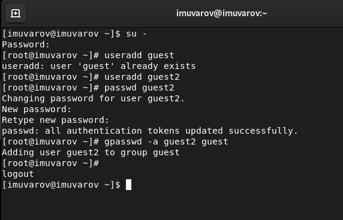
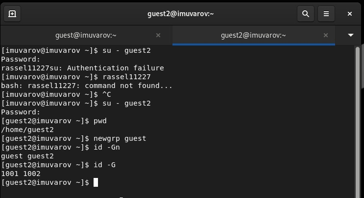

# Лабораторная работа №3
<!-- _class: fio -->
Уваров Илья
НПИбд-02-19

## Цель работы
 Получение практических навыков работы в консоли с атрибутами файлов для групп пользователей.

### Выполнение лабораторной работы
1. В установленной операционной системе создал учётную запись пользователя guest. Задал пароль для пользователя guest. Аналогично создал второго пользователя guest2. Добавил пользователя guest2 в группу guest (рис. 1).

 
2. Осуществил вход в систему от двух пользователей на двух разных консолях: guest на первой консоли и guest2 на второй консоли. Для обоих пользователей определил директорию,в которой нахожусь: /home/guest и /home/guest2, что соответствует приглашениям командной строки. Для пользователя guest: имя пользователя - guest, его группа 1001(guest), принадлежит к группе guest. Для пользователя guest2: имя пользователя - guest2, его группа 1002(guest2), принадлежит к группам guest и guest2.Вывод команды groups аналогичен выводам команд id -Gn и id -G (рис. 2-3).

3. Сравнил полученную информацию с содержимым файла /etc/group (рис. 4).

4. От имени пользователя guest2 выполнил регистрацию пользователя guest2 в группе guest.

5.  От имени пользователя guest изменил права директории /home/guest, разрешив все действия для пользователей группы. Снял с директории /home/guest/dir1 все атрибуты, проверил правильность снятия атрибутов.

6. Заполнил таблицу «Установленные права и разрешённые действия».
 

7. На основании заполненной таблицы определил иные минимально необходимые права для выполнения операций внутри директории.

## Вывод
Получил практические навыки работы в консоли с атрибутами файлов для групп пользователей.
