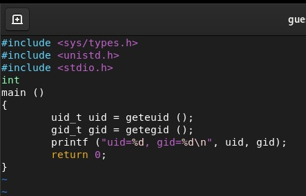
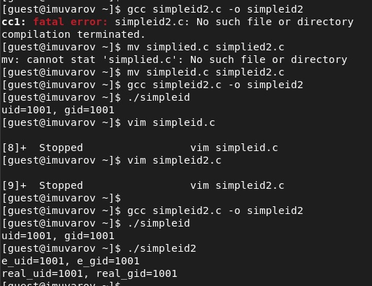
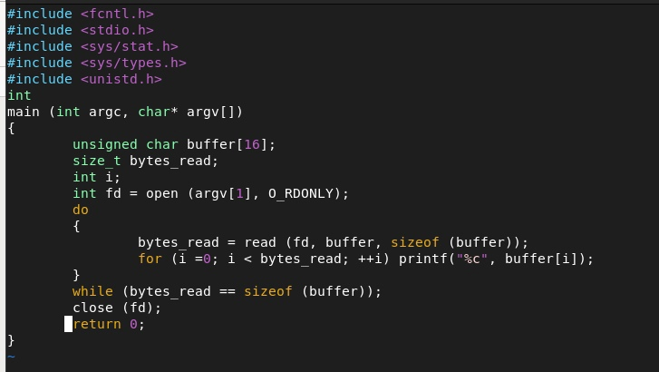
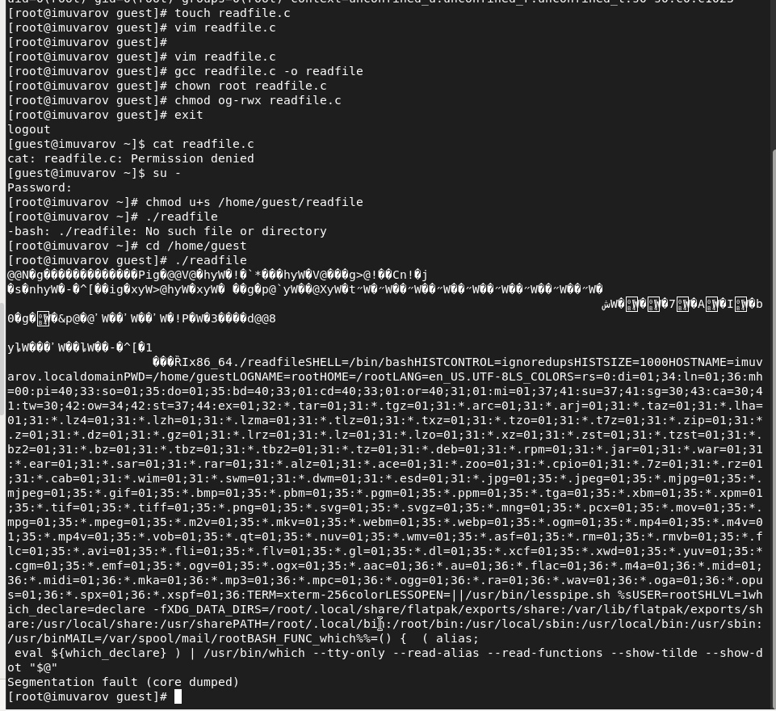
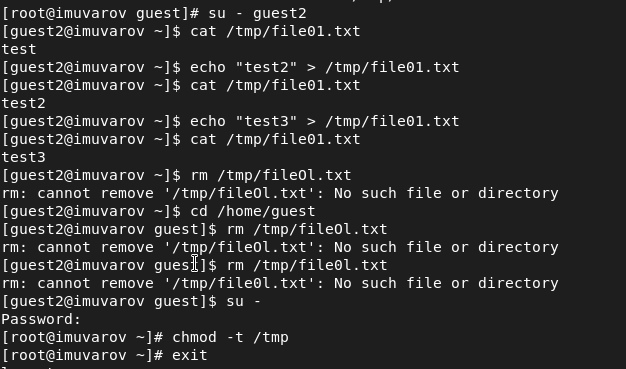

# Лабораторная работа №5
<!-- _class: fio -->
Уваров Илья
НПИбд-02-19

---
## Цель работы
 Изучение механизмов изменения идентификаторов, применения SetUID- и Sticky-битов. Получение практических навыков работы в консоли с дополнительными атрибутами. Рассмотрение работы механизма смены идентификатора процессов пользователей, а также влияние бита Sticky на запись и удаление файлов.

---
### Выполнение лабораторной работы
1. Вошёл в систему от имени пользователя guest и создал программу simpleid.c (рис. 1).

---
2. Скомпилировал программу и убедился, что файл программы создан. Выполнил программу simpleid. Выполнил системную программу id. В отличие от команды id, моя программа не выводит контекст и все группы, в которые пользователь (рис. 2).

---
3. Усложнил программу, добавив вывод действительных идентификаторов (рис. 3).

---
4. Получившуюся программу назвал simpleid2.c. Скомпилировал и запустил simpleid2.c (рис. 4).

---
5. От имени суперпользователя выполнил команды chown root:guest /home/guest/simpleid2 и chmod u+s /home/guest/simpleid2. Первая команда меняет владельца файла simpleid2 на группу guest. Вторая команда меняет права доступа к файлу simpleid2 для пользователя и установленные атрибуты SUID или SGID позволяют запускать файл на выполнение с правами владельца файла или группы соответственно. Выполнил проверку правильности установки новых атрибутов и смены владельца файла simpleid2. Запустил simpleid2 и id. Сравнил результаты (рис. 5).

---
6. Проделал тоже самое относительно SetGID-бита (рис. 6).

---
7. Создал программу readfile.c (рис. 7).

---
8. Откомпилировал программу. Сменил владельца у файла readfile.c и изменил права так, чтобы только суперпользователь (root) мог прочитать его, a guest не мог. Проверил, что пользователь guest не может прочитать файл readfile.c. Сменил у программы readfile владельца и установил SetU’D-бит. Проверил, может ли программа readfile прочитать файл readfile.c (рис. 8).

---
9. Выяснил, установлен ли атрибут Sticky на директории /tmp. От имени пользователя guest создал файл file01.txt в директории/tmp со словом test. Просмотрел атрибуты у только что созданного файла и разрешил чтение и запись для категории пользователей «все остальные» (рис. 9).

---
10. От пользователя guest2 попробовал прочитать файл /tmp/file01.txt. От пользователя guest2 попробовал дозаписать в файл /tmp/file01.txt слово test2. Удалось выполнить операцию. Проверил содержимое файла. От пользователя guest2 попробовал записать в файл /tmp/file01.txt слово test3, стерев при этом всю имеющуюся в файле информацию. Удалось выполнить операцию. Проверил содержимое файла. От пользователя guest2 попробовал удалить файл /tmp/file01.tx. Не удалось выполнить операцию. Повысил свои права до суперпользователя и выполнил после этого команду, снимающую атрибут t (Sticky-бит) с директории /tmp. Покинул режим суперпользователя. От пользователя guest2 проверил, что атрибута t у директории /tmp нет. Повторил предыдущие шаги. Удалось успешно выполнить каждый шаг. Повысил свои права до суперпользователя и вернул атрибут t на директорию /tmp (рис. 10).

---
# Выводы

Изучил механизмы изменения идентификаторов, применения SetUID- и Sticky-битов. Получил практические навыки работы в консоли с дополнительными атрибутами. Рассмотрел работы механизма смены идентификатора процессов пользователей, а также влияние бита Sticky на запись и удаление файлов.
