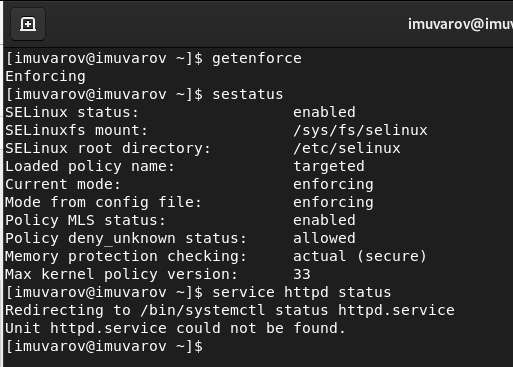
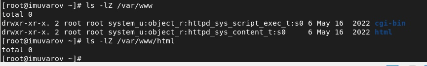
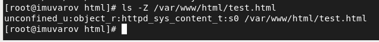

# Лабораторная работа №6
<!-- _class: fio -->
Уваров Илья
НПИбд-02-19

# Цель работы

Развить навыки администрирования ОС Linux. Получить первое практическое знакомство с технологией SELinux. Проверить работу SELinx на практике совместно с веб-сервером Apache.

# Выполнение лабораторной работы

1. Вошёл в систему с полученными учётными данными и убедился, что SELinux работает в режиме enforcing политики targeted. Обратился с помощью браузера к веб-серверу, запущенному на компьютере, и убедился, что последний работает (рис. 1).

 

2. Нашёл веб-сервер Apache в списке процессов, определил его контекст безопасности (рис. 2).

3. Посмотрел текущее состояние переключателей SELinux для Apache (рис. 3).

4. Посмотрел статистику по политике с помощью команды seinfo, также определил множество пользователей, ролей, типов (рис. 4).

5. Определил тип файлов и поддиректорий, находящихся в директории /var/www. Определил тип файлов, находящихся в директории /var/www/html. Определил круг пользователей, которым разрешено создание файлов в директории (рис. 5).

6. Создал от имени суперпользователя html-файл (рис. 6).

7. Проверил контекст созданного файла. Контекст, присваиваемый по умолчанию вновь созданным файлам в директории /var/www/html: httpd_sys_content (рис. 7).

8. Обратился к файлу через веб-сервер, введя в браузере адрес http://127.0.0.1/test.html. Файл не отображён(рис. 8).

9. Изменил контекст файла /var/www/html/test.html с httpd_sys_content_t на samba_share_t. После этого проверил, что контекст поменялся (рис. 9).

10. Попробовал ещё раз получить доступ к файлу через веб-сервер, введя в браузере адрес http://127.0.0.1/test.html (рис. 10).

11. Проанализировал ситуацию. Почему файл не был отображён,если права доступа позволяют читать этот файл любому пользователю? Просмотрел log-файлы веб-сервера Apache. Также просмотрите системный лог-файл. Если в системе окажутся запущенными процессы setroubleshootd и audtd, то вы также сможете увидеть ошибки, аналогичные указанным выше, в файле /var/log/audit/audit.log. Проверьте это утверждение самостоятельно (рис. 11).

12. Попробовал запустить веб-сервер Apache на прослушивание ТСР-порта 81. Файл /etc/httpd/httpd.conf пуст. Видимо при установке Apache произошли ошибки.

# Выводы

Развил навыки администрирования ОС Linux. Получил первое практическое знакомство с технологией SELinux. Проверил работу SELinx на практике совместно с веб-сервером Apache.
